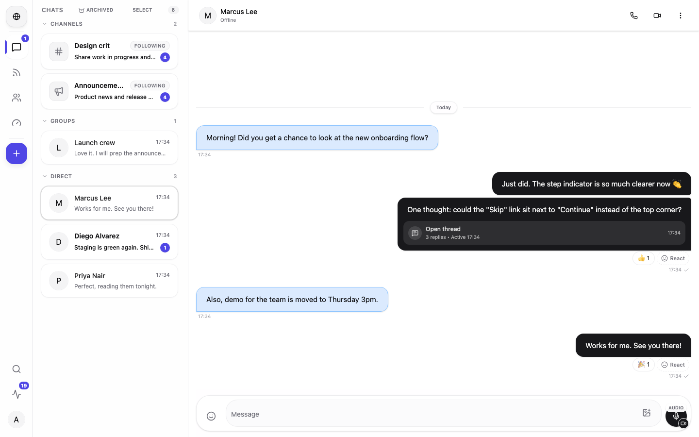
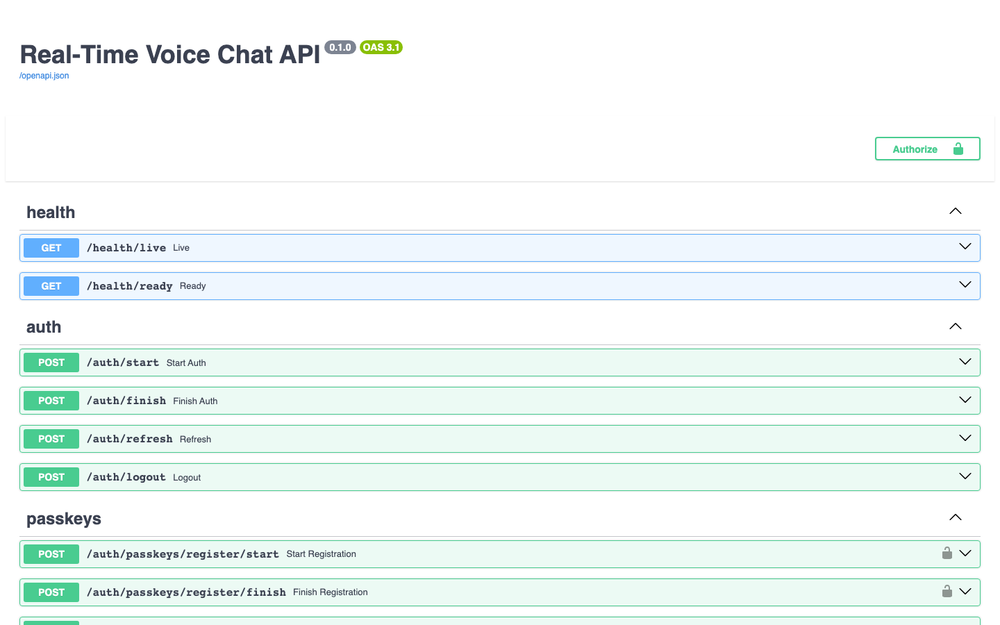

# Vogi Backend

The API and realtime server behind **Vogi**, a messaging platform for direct messages, groups, spaces, channels with feed and chat views, threads, polls, and 1:1 voice and video calls.

Built with FastAPI and Socket.IO on MongoDB, Redis and RabbitMQ. The web client lives in the sibling [`web-voice-chat`](../web-voice-chat) repository.

<p align="center">
  
  
</p>

## Features

- **Email code and passkey sign-in** with rotating refresh tokens.
- **Containers.** A message belongs to a `conversation` (DM or group) or a `channel`, so DMs, groups and channels share one messaging API.
- **Spaces** own channels and groups. A space owner is the effective owner of everything inside it.
- **Channels** have a feed view (posts and comments) and a chat view over the same messages.
- **Threads, reactions, pins, forwarding, edits, scheduled messages, drafts, media and rich content** (stickers, voice, location, contacts, link previews).
- **Connections, follows and memberships** in one `relationships` table, with blocks that apply everywhere.
- **Server-side authorization** with dotted permissions, roles and a capabilities API that clients render from.
- **Realtime delivery** over Socket.IO: messages, receipts, typing, presence and invalidation events.
- **1:1 WebRTC calls** with call recovery after a reload, using coturn or Cloudflare TURN.
- **Polls**, notifications, saved messages, search, a directory, webhooks and slash commands.

## Quick start

Requirements: Docker, plus Python `>=3.12,<3.14` with Poetry if you want to run code on the host.

```bash
cp .env.example .env              # then fill in local values
docker compose up -d              # API, worker, Mongo, Redis, RabbitMQ, MailHog, MinIO, coturn
```

- API: <http://localhost:8000>. Interactive docs are at <http://localhost:8000/docs>.
- Verification emails arrive in MailHog at <http://localhost:8025>.

To run the API on the host instead, keeping the infrastructure in Docker:

```bash
poetry install
poetry run uvicorn app.main:asgi_app --reload
poetry run python -m app.workers.main   # in a second terminal
```

> `app.main:asgi_app` is the right target. It serves REST **and** Socket.IO. `app.main:app` is the bare FastAPI app without realtime.

If Poetry picks up a Python newer than 3.13, run `poetry env use /opt/homebrew/bin/python3.13 && poetry install`.

### Services

| Service | Port | Purpose |
|---|---|---|
| `api` | 8000 | FastAPI + Socket.IO (`uvicorn app.main:asgi_app`) |
| `worker` | none | Email consumer, scheduled-message sender, poll auto-close (`python -m app.workers.main`) |
| `mongo` | 27017 | Primary database |
| `mongo-express` | 8081 | Mongo admin UI |
| `redis` | 6379 | Presence, rate limits, Socket.IO manager |
| `rabbitmq` | 5672 / 15672 | Job queues and management UI |
| `mailhog` | 1025 / 8025 | SMTP sink and web UI |
| `minio` | 9000 / 9001 | S3-compatible storage and console |
| `coturn` | 3478 | TURN relay for calls |
| `api_test` | 8001 | API on the `voicechat_test` database (profile `test`) |

## Tests

Integration tests must run **inside the Docker network**, because their fixtures resolve `mongo` and `redis` by compose hostname:

```bash
docker compose --profile test up -d api_test
docker exec voicechat_api_test sh -lc 'cd /app && pytest -q app/tests'
```

Unit tests also run on the host with `poetry run pytest app/tests/unit`. More detail is in [docs/testing.md](./docs/testing.md).

## OpenAPI

`openapi.json` (168 paths) is generated from the code. Regenerate it after changing routes or schemas:

```bash
poetry run python app/scripts/dump_openapi.py
```



## Documentation

| | |
|---|---|
| [Architecture](./docs/architecture.md) | Runtime, code layout, containers, HTTP envelope, realtime |
| [Authorization](./docs/authorization.md) | Permissions, resolution order, roles, capabilities |
| [Configuration](./docs/configuration.md) | Environment variables |
| [Testing](./docs/testing.md) | Running suites, test email delivery |
| [API reference index](./docs/index.md) | One page per module |

Design rationale for individual modules lives next to the code in `app/modules/authorization/AGENTS.md` and `app/modules/resources/AGENTS.md`.

## Project layout

```text
app/
  main.py · factory.py · routes.py · socket.py   entrypoint, app factory, router mounting, Socket.IO
  core/      settings, security, HTTP envelope, middleware
  db/        Mongo connection and Beanie document models
  infra/     email, queue and storage adapters
  modules/   one package per domain: router · service · repository · schemas
  bots/      built-in bots (PollBot)
  workers/   background processes
  scripts/   migrations, backfills, OpenAPI dump
  tests/     unit and integration suites
docs/        this documentation
```
