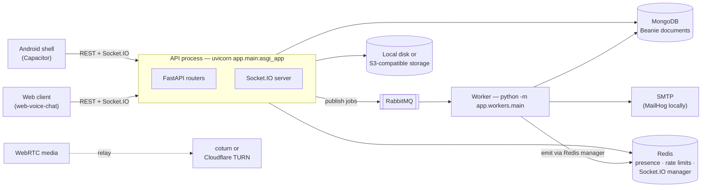
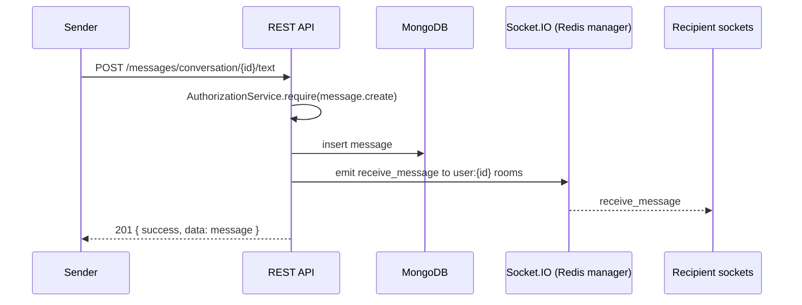

# Architecture

## Purpose

This page explains how the backend is put together and the few rules that shape almost every module. Endpoint details live in the per-module pages listed in the [index](./index.md); request and response schemas live in `openapi.json`.

## Runtime



- **One ASGI app** serves both HTTP and Socket.IO. `app.main:asgi_app` wraps the FastAPI app (`app/factory.py`) with the Socket.IO server (`app/socket.py`). Run that target, not `app.main:app`.
- **The worker** (`app/workers/main.py`) runs three loops in one process:
  - the email consumer (`email_worker.py`, queue `EMAIL_QUEUE_NAME`)
  - the scheduled-message poller, which releases due scheduled messages
  - the poll auto-closer
- The worker reaches connected clients through `socket_emitter.py`, which writes to the Redis-backed Socket.IO manager rather than holding sockets itself.
- `push_worker.py` consumes `PUSH_QUEUE_NAME`. It is **not** started by `app.workers.main`; run `python -m app.workers.push_worker` separately when push delivery is needed.
- **Media for calls is peer-to-peer.** The backend only stores call lifecycle state, relays SDP and ICE candidates over Socket.IO, and hands out TURN credentials. See [Calls](./calls.md) and [WebRTC](./webrtc.md).

## Code layout

```text
app/
  main.py, asgi.py, factory.py   ASGI entrypoint, app factory, middleware, CORS
  routes.py                      every router is mounted here
  socket.py, lifespan.py         Socket.IO server, startup and shutdown
  core/                          settings, security, HTTP envelope, logging
  db/                            Mongo connection, Beanie init, document models
  infra/                         email, queue and storage adapters
  modules/<name>/                router.py · service.py · repository.py · schemas.py · dependencies.py
  bots/                          built-in bot users (PollBot) and the poll engine
  workers/                       background processes
  scripts/                       migrations, backfills, dump_openapi.py
  tests/                         unit and integration suites
```

Routers parse the request and call a service. **Services own business rules and authorization** (they call `AuthorizationService.require()`), and repositories own queries. Routers never gate on permissions themselves. See [Authorization](./authorization.md).

## Core model

### Everything is a container

A message never names a conversation directly. It names its parent with `container_type` plus `container_id`:

| `container_type` | What it is | Created through |
|---|---|---|
| `conversation` | A DM between two people, or a group | [Conversations](./conversations.md) |
| `channel` | A first-class broadcast or discussion space, standalone or owned by a space | [Channels](./channels.md) |

This is why the message collection routes are `/messages/{container_type}/{container_id}/…`, and why channel posts and their comments are simply root messages and thread replies. A channel's **feed** is a read model over its root messages; see [Feeds](./feeds.md).

**Spaces** group channels and groups under one owner and one member list. Every user also has a profile channel, which backs their profile feed (`POST /users/me/posts`).

### One membership table

The `relationships` collection is the single source of truth for who is connected to whom and who belongs to what:

- connections between users
- follows of users and channels
- memberships of conversations, channels and spaces
- per-viewer inbox state: pinned, archived, folder, notification level, draft

`ParticipantDocument`, `SpaceMemberDocument` and `JoinRequestDocument` look like collections but back **no collections**. They are compatibility views over `relationships` (`app/modules/relationships/compat.py`). Do not query or cascade them directly. See [Relationships](./relationships.md).

### No transactions

Nothing opens a Mongo session. Multi-collection work is ordered so that a partial failure leaves the data safe, and `app/modules/resources/cascade.py` is the reference:

- children are deleted before parents, and the parent record last
- the realtime audience is snapshotted **before** the `relationships` rows it is derived from are removed

The reasoning is recorded in `app/modules/resources/AGENTS.md`.

## HTTP conventions

- **Auth:** `Authorization: Bearer <access_token>` on every protected route. Tokens come from [Auth](./auth.md) or [Passkeys](./passkeys.md).
- **Success envelope:**

  ```json
  { "success": true, "data": { "…": "…" }, "request_id": "…" }
  ```

- **Paginated envelope** adds `meta`:

  ```json
  { "success": true, "data": [], "meta": { "cursor": null, "next_cursor": "…", "limit": 50, "total": null }, "request_id": "…" }
  ```

  Pass `next_cursor` back as `cursor` to fetch the next page.
- **Error envelope** carries a stable machine-readable `code`:

  ```json
  { "success": false, "error": { "code": "SPACE_FORBIDDEN", "message": "Not a member of this space", "details": null }, "request_id": "…" }
  ```

- **Request ids:** every response carries `x-request-id`. Quote it when reporting a problem.
- **Rate limits** are stored in Redis (`RATE_LIMIT_STORAGE_URI`) and keyed by client address. Auth and destructive routes such as space deletion have tighter limits.

## Realtime

Each authenticated socket joins `user:{user_id}`. Channel traffic fans out through `channel:{channel_id}` rooms, which a client joins explicitly. The full event list is in [Realtime](./realtime.md).



REST is always the source of truth for writes. Socket events tell other clients that something changed.

## Further reading

- `app/modules/authorization/AGENTS.md`: why authorization is shaped the way it is
- `app/modules/resources/AGENTS.md`: deletion ordering and cascade rules
- `../openspec/changes/archive/` in the superproject: design notes and rejected alternatives for every major change
